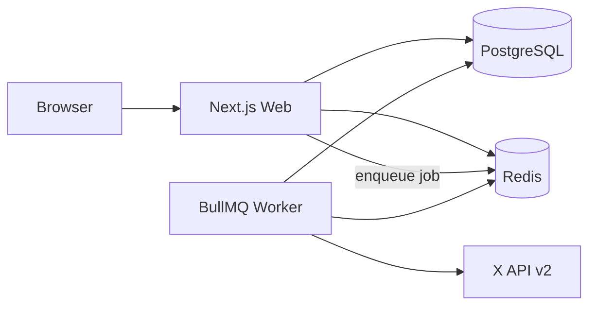

# Self-Host Guide

Run PostWave on your own machine or server. You provide all credentials and infrastructure.

## Requirements

- Node.js 20+, pnpm 9+
- Docker (recommended for Postgres + Redis)
- X Developer account with OAuth 2.0 app ([setup guide](X_DEVELOPER_SETUP.md))

## Docker Compose (recommended)

```bash
# 1. Clone
git clone https://github.com/YOUR_USER/X-Post-Creator.git
cd X-Post-Creator

# 2. Configure
cp .env.example .env
# Edit .env — see Environment variables below

# 3. Start Postgres + Redis
docker compose up -d

# 4. Database schema
pnpm install
pnpm db:push

# 5. Run web + worker (two terminals)
pnpm dev
pnpm dev:worker
```

Open http://localhost:3000, create an account, connect X in Settings, schedule a test post.

## Environment variables

| Variable | Required | Description |
|----------|----------|-------------|
| `DATABASE_URL` | Yes | PostgreSQL connection string |
| `REDIS_URL` | Yes | Redis for BullMQ |
| `AUTH_SECRET` | Yes | NextAuth secret (`openssl rand -base64 32`) |
| `TOKEN_ENCRYPTION_KEY` | Yes | 32-byte base64 for OAuth token encryption |
| `NEXT_PUBLIC_APP_URL` | Yes | e.g. `http://localhost:3000` |
| `X_CLIENT_ID` | Yes | X OAuth app client ID |
| `X_CLIENT_SECRET` | Yes | X OAuth app secret |
| `X_CALLBACK_URL` | Yes | `{APP_URL}/api/x/callback` |
| `RESEND_API_KEY` | No | Failure alert emails |
| `EMAIL_FROM` | No | Sender for alert emails |
| `STORAGE_TYPE` | No | `local` (default) or `s3` |
| `S3_*` | If s3 | S3-compatible storage for image uploads |
| `RATE_LIMIT_ENABLED` | No | `true` to enable basic rate limits |

## Architecture



## Image uploads

- **Local (`STORAGE_TYPE=local`)**: Files saved to `apps/web/uploads/` — works with Docker Compose.
- **S3 (`STORAGE_TYPE=s3`)**: Required for serverless web hosts. Set `S3_BUCKET`, credentials, and optional `S3_PUBLIC_URL`.

The worker fetches image URLs at publish time — ensure URLs are reachable from the worker process.

## Smoke test

After setup, run through [scripts/e2e-smoke-test.md](../scripts/e2e-smoke-test.md).

## Disclaimer

You are the operator. See [DISCLAIMER.md](../DISCLAIMER.md).
