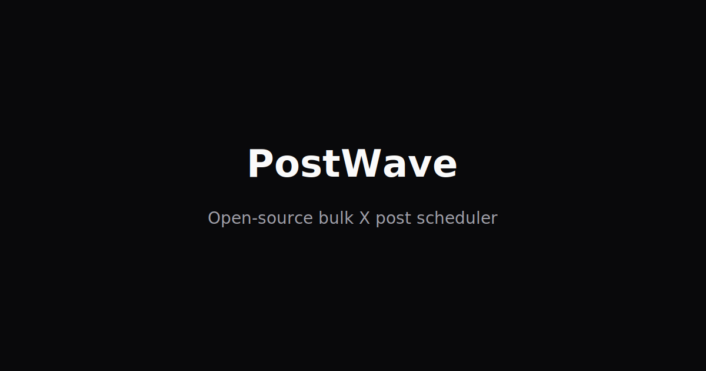

# Showcase — GitHub & X Posts

Use these as starting points when sharing PostWave.

## GitHub repo description

> Open-source bulk X post scheduler. Next.js 16 + BullMQ + official X API v2. Self-host with Docker or deploy to your AWS account.

## X / Twitter thread (short)

**Post 1:**
Built an open-source bulk X scheduler called PostWave.

Paste a week of posts → set times → close laptop → worker publishes via official X API.

Next.js 16 · BullMQ · PostgreSQL · MIT license

**Post 2:**
Features:
• Bulk paste import
• Timezone scheduling
• Image posts
• Drafts + edits + retry
• Self-host on Docker or AWS

**Post 3:**
No paywalls. Your infrastructure, your X API keys, your data.

GitHub: [your-repo-url]

## One-liner bio link

PostWave — OSS bulk X scheduler you self-host

## Demo banner (if hosting a public demo)

> Demo instance only. [Self-host for production](https://github.com/YOUR_USER/X-Post-Creator/blob/main/docs/SELF_HOST.md). [Disclaimer](https://github.com/YOUR_USER/X-Post-Creator/blob/main/DISCLAIMER.md).

## Screenshot

Replace `docs/screenshot.svg` with a real queue screenshot when available.
